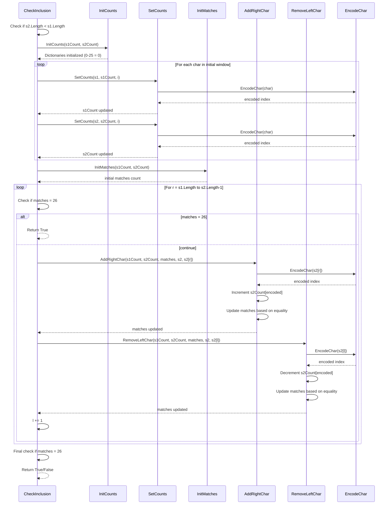
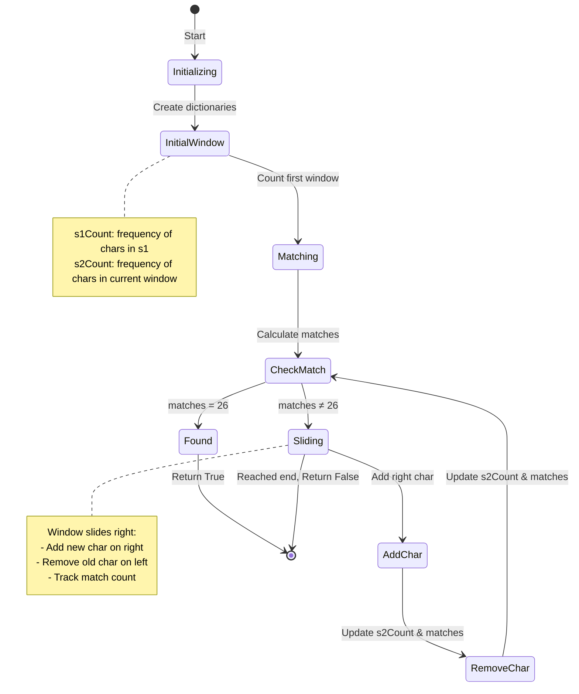
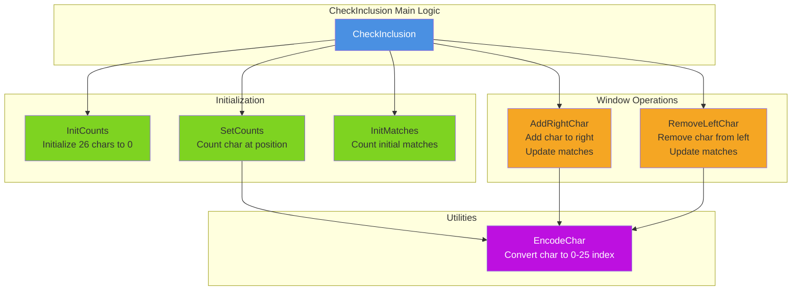

## LeetCode 567 - FPermutation in string

Given two strings s1 and s2, return true if s2 contains a permutation of s1, or false otherwise.

In other words, return true if one of s1's permutations is the substring of s2.

 

Example 1:

Input: s1 = "ab", s2 = "eidbaooo"
Output: true
Explanation: s2 contains one permutation of s1 ("ba").
Example 2:

Input: s1 = "ab", s2 = "eidboaoo"
Output: false
 

Constraints:

1 <= s1.length, s2.length <= 104
s1 and s2 consist of lowercase English letters.

```mermaid
flowchart TD
    Start([Start: CheckInclusion s1, s2]) --> CheckLen{s2.Length < s1.Length?}
    CheckLen -->|Yes| ReturnFalse1[Return False]
    CheckLen -->|No| InitDicts[Initialize s1Count and s2Count<br/>dictionaries with 0-25 = 0]
    
    InitDicts --> PopulateInit[Populate initial window:<br/>For i = 0 to s1.Length-1<br/>Count chars in s1 and first window of s2]
    
    PopulateInit --> CalcMatches[Calculate initial matches<br/>matches = count where s1Count[i] = s2Count[i]]
    
    CalcMatches --> InitPointers[Initialize pointers:<br/>l = 0<br/>r = s1.Length]
    
    InitPointers --> LoopCheck{r < s2.Length?}
    
    LoopCheck -->|No| FinalCheck{matches = 26?}
    FinalCheck -->|Yes| ReturnTrue2[Return True]
    FinalCheck -->|No| ReturnFalse2[Return False]
    
    LoopCheck -->|Yes| CheckMatches{matches = 26?}
    CheckMatches -->|Yes| ReturnTrue1[Return True]
    
    CheckMatches -->|No| AddRight[AddRightChar:<br/>Add s2[r] to window<br/>Update s2Count and matches]
    
    AddRight --> RemoveLeft[RemoveLeftChar:<br/>Remove s2[l] from window<br/>Update s2Count and matches]
    
    RemoveLeft --> IncrementPtrs[l += 1<br/>r += 1 implicit in loop]
    
    IncrementPtrs --> LoopCheck
    
    ReturnTrue1 --> End([End])
    ReturnTrue2 --> End
    ReturnFalse1 --> End
    ReturnFalse2 --> End

    style Start fill:#90EE90
    style End fill:#FFB6C1
    style ReturnTrue1 fill:#98FB98
    style ReturnTrue2 fill:#98FB98
    style ReturnFalse1 fill:#FFA07A
    style ReturnFalse2 fill:#FFA07A
```







