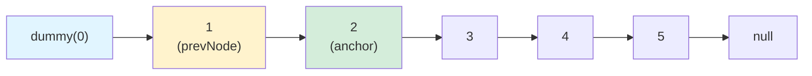
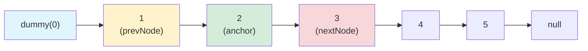
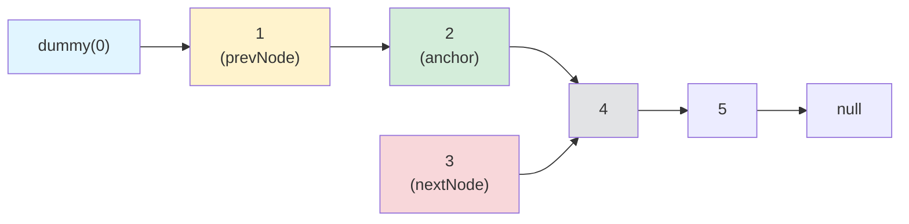
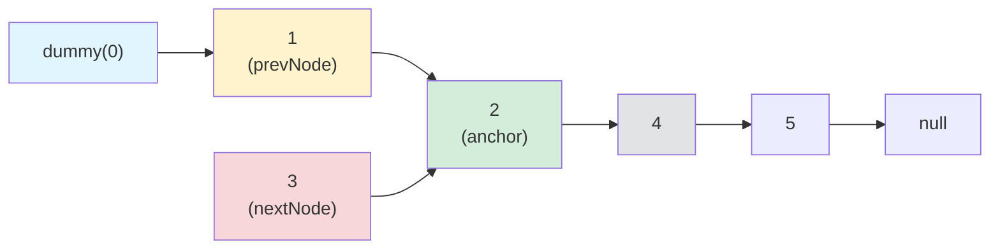
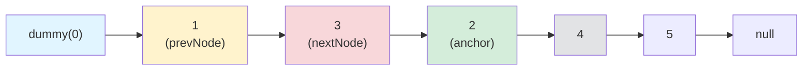

# Head-to-Front Linked list Algorithms

## First Iteration
### Initial State


### Step 1: set nextNode
```visualbasic
Dim nextNode = anchor.next
```


### Step 2: target anchor.next to anchor.next.next
```visualBasic
anchor.next = anchor.next.next
```

### Step 3 - move nextNode to point to prevNode.next

```vb
nextNode.next = prevNode.next
```


### Step 4, reconnect nextNode to the graph
```vb
prevNode.next = nextNode
```



## Subsequent Iterations...
